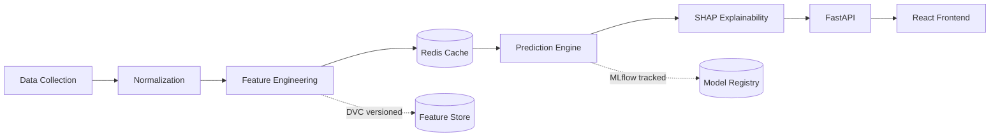

# BallMetrix

**Explainable ML platform for football match predictions.**

WinScope aggregates data from multiple football sources, engineers predictive features, runs a tracked and versioned ML pipeline (XGBoost + Poisson + Monte Carlo simulation), and presents transparent, explainable predictions inside a premium analytics dashboard — built like an MLOps pipeline, not a notebook wearing a UI.

> 🚧 **Status:** Early development. Architecture and API surface described below are the target design; see [`docs/ROADMAP.md`](docs/ROADMAP.md) for the phased build plan and current progress.


---

## What it does

1. User selects two teams still alive in the tournament.
2. Backend pulls live stats, injuries, odds, and weather from external sources (cached in Redis).
3. Feature engineering layer builds ELO ratings, rolling form, and head-to-head features.
4. XGBoost predicts win/draw/loss; a Poisson model generates expected scorelines; 10,000 Monte Carlo simulations stress-test the outcome distribution.
5. SHAP explains exactly what drove the prediction.
6. Results render in a full analytics dashboard — probability breakdown, tactical analysis, team comparison, confidence scoring, and more.

## Tech stack

**Frontend** — React (Vite), Tailwind CSS, React Router, TanStack Query, Framer Motion, Recharts, shadcn/ui

**Backend** — FastAPI, SQLAlchemy, Alembic, Pydantic, Pandas, NumPy

**ML** — XGBoost, Poisson distribution modeling, Monte Carlo simulation, SHAP

**Data & Infra** — PostgreSQL, Redis, Docker

**MLOps** — MLflow (experiment tracking), DVC (data & feature versioning), a promotion-gated model registry, and a CI/CD retraining pipeline (GitHub Actions)

## Architecture



## Project structure

```
winscope/
├── apps/
│   ├── frontend/        # React + Vite dashboard
│   └── backend/         # FastAPI service
├── ml/                  # Training pipeline, feature engineering, model artifacts
├── infra/               # Docker Compose, deployment configs
├── docs/
│   └── ROADMAP.md       # Phased build plan
└── README.md
```

## Getting started

> Setup instructions will be filled in as each phase lands. Placeholder below for the eventual local dev flow.

```bash
# Clone
git clone https://github.com/<your-username>/winscope.git
cd winscope

# Backend + DB + Redis
docker compose up -d

# Frontend
cd apps/frontend
npm install
npm run dev
```

## Roadmap

Full phased plan — data strategy, MVP walking skeleton, ML pipeline, live data integration, MLOps/CI-CD, and design polish — lives in [`docs/ROADMAP.md`](docs/ROADMAP.md).

## Disclaimer

Predictions are generated for educational and portfolio purposes. WinScope is not affiliated with, endorsed by, or sponsored by FIFA. Data pulled from third-party sources is subject to those sources' own terms of use, independent of this repository's license.

## License

MIT — see [`LICENSE`](LICENSE).
